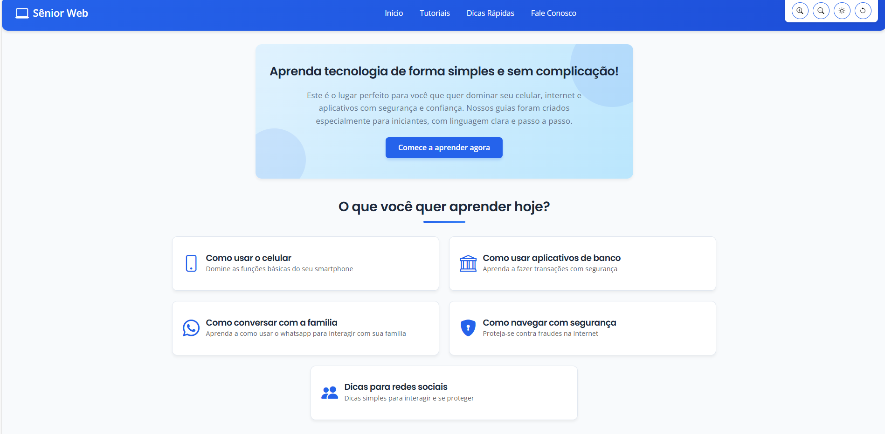

# Sênior Web - Inclusão Digital para a Melhor Idade



## 📖 Sobre o Projeto

O **Sênior Web** é um portal educacional desenvolvido para facilitar o acesso de idosos à tecnologia. O projeto tem como objetivo principal oferecer um ambiente amigável, seguro e acessível, com tutoriais simplificados sobre o uso de celulares, internet e aplicativos, capacitando o público sênior a se conectar com o mundo digital de forma independente e segura.

Este projeto foi desenvolvido como uma aplicação web full-stack, integrando um front-end estático com um back-end dinâmico e um banco de dados relacional.

---

## ✨ Funcionalidades Principais

*   **Página Inicial e Tutoriais:** Interface pública com conteúdo educacional e navegação intuitiva.
*   **Recursos de Acessibilidade:** Controles para aumento/diminuição de fonte e modo de alto contraste.
*   **Formulário de Contato:** Permite que os usuários enviem mensagens, que são armazenadas de forma segura.
*   **Painel Administrativo:** Uma área segura e protegida por senha para visualizar as mensagens recebidas.
    *   **Tela de Login:** Garante que apenas usuários autorizados acessem a área administrativa.
    *   **Dashboard de Mensagens:** Exibe todas as mensagens de contato recebidas do banco de dados.

---

## 🚀 Tecnologias Utilizadas

Este projeto foi construído utilizando uma arquitetura moderna e desacoplada:

### Front-End
*   **HTML5:** Estruturação semântica e acessível do conteúdo.
*   **CSS3:** Estilização responsiva com Flexbox e Grid, além de variáveis CSS para temas.
*   **JavaScript (ES6+):** Manipulação do DOM, interatividade e comunicação com a API (`fetch`).
*   **Bootstrap 5:** Framework para componentes de UI e layout responsivo.

### Back-End
*   **Node.js:** Ambiente de execução para o servidor.
*   **Express.js:** Framework para a criação da API RESTful e gerenciamento de rotas.
*   **Bibliotecas de Segurança:**
    *   `helmet`: Para proteção de cabeçalhos HTTP.
    *   `express-rate-limit`: Para prevenir ataques de força bruta.
    *   `cors`: Para gerenciar o acesso de diferentes domínios.

### Banco de Dados
*   **MySQL:** Sistema de gerenciamento de banco de dados relacional para armazenamento das mensagens.

### Hospedagem
*   **Front-End:** Hospedado no **Netlify**, com deploy contínuo a partir do GitHub.
*   **Back-End e Banco de Dados:** Hospedados no **Railway**, garantindo uma infraestrutura escalável e segura.

---

## 🛠️ Como Executar o Projeto Localmente

Para rodar este projeto em um ambiente de desenvolvimento local, siga os passos abaixo:

1.  **Clonar o Repositório:**
    ```bash
    git clone https://github.com/seu-usuario/seu-repositorio.git
    cd seu-repositorio
    ```

2.  **Configurar o Back-End:**
    *   Navegue até a pasta do servidor:
      ```bash
      cd server
      ```
    *   Instale as dependências:
      ```bash
      npm install
      ```
    *   Crie um arquivo `.env` na raiz da pasta `server/` e adicione as seguintes variáveis:
      ```env
      # Credenciais do seu banco de dados local ou remoto
      MYSQL_HOST=seu_host_de_banco
      MYSQL_USER=seu_usuario
      MYSQL_PASSWORD=sua_senha
      MYSQL_PORT=sua_porta
      MYSQL_DATABASE=seu_banco

      # Chave secreta para o painel admin
      ADMIN_TOKEN=uma_chave_secreta_muito_forte

      # Porta para o servidor local
      PORT=3001
      ```

3.  **Iniciar o Back-End:**
    ```bash
    npm start
    ```
    O servidor estará rodando em `http://localhost:3001`.

4.  **Visualizar o Front-End:**
    *   Para uma melhor experiência, use uma extensão como o **Live Server** no VS Code para abrir os arquivos `index.html` ou `contato.html`.

---

## 👨‍💻 Autor

Desenvolvido pela equipe **Sênior Web**.

📍 Manaus, AM - Brasil  
📧 [seniorweb2025@gmail.com](mailto:seniorweb2025@gmail.com)